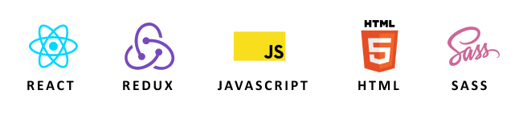

# MEME

## Projekt końcowy Akademia Leona Koźmiśkiego

### Kierunek: "Frotend Development z React"

### Użyte technologie



### Opis:

Aplikacja webowa "Meme", która umożliwia dodawanie memów w formacie "jpg", "jpeg", ocenianie ich, oraz gromadzenie ich w swojej kolekcji "ulubione".

## Funkcjonalność:

- Dodawanie memów w postaci linku lub pliku w formacie "jpg", "jpeg" z lokalnej przestrzeni dyskowej,
- Ocenianie poszczególnych memów,
- Oznaczanie Memów jako ulubione,
- Filtrowanie memów na 3 różne przestrzenie: "Regular", "Hot", "Favorite",
- Formularz z przyjaznym Interface,

## Instalacja

MEME wymaga zainstalowanego Node.js v10+

Zainstaluj projekt lokalnie na swoim kompuetrze i uruchom serwer.

[wejdź na stronę projektu](https://github.com/wfRud/Memory-react-game) Pobierz Zip projektu.
Lub
Utwórz lokalnie na swoim komputerze folder w którym chcesz przechowywać projekt i uruchom komendę:

```sh
git clone https://github.com/wfRud/ALK_projekt-koncowy.git
cd ALK_projekt-koncowy
npm install
```

Następnie aby uruchomić projekt lokalnie w swojej przeglądarce wpisz komendę:

```sh
npm run start
```

Jeżeli chcesz mieć możliwość dodawanie lokalnych plików, pamiętaj by uruchomić dodatkowo lokalny serwer obsługujący przesyłanie plików do folderu projektu. W tym celu uruchom dodatkowo okno w swoim terminalu, przejdź do folderu projektu i podaj komendę:

```sh
npm run server
```
